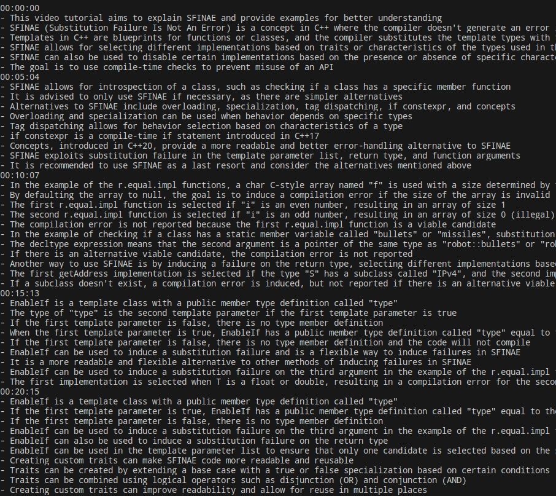

# skonaki ✍️

Study smarter, not harder: Create cheatsheets out of videos 🪄

## What is `skonaki`?

`skonaki` is a tool that allows you to create cheatsheets out of videos. 
It is a command line tool that takes a path to a video or audio file and produces
a list of bullet points with the most important information from the video.
The bullet points are accompanied by timestamps, in case you need to refer back
to the video and check a specific part for yourself. 
You can determine how often you would like to "sample" the video and, if you choose,
you could take control of the cheatsheet generation process by providing your own
prompts.

While `skonaki` cannot and should not replace studying, it can accelerate your learning
process by allowing you to quickly go through recordings and produce a set of notes
that you can further refine and study from.

The name `skonaki` comes from the Greek word "σκονάκι" (skonaki), which means "cheatsheet".

## Why use `skonaki`?

`skonaki` is a tool that can help you study smarter, not harder.
I used it to avoid having to watch the video lectures at a course I am taking.
You could use it to create notes out of your recordings, meetings, or even podcasts.

## How does `skonaki` work?

Ultimately, what `skonaki` does is split audio from video, then transcribe it using
the Whisper OpenAI API and finally use the transcription to create a cheatsheet with the most
important information from the video.
The cheatsheet generation is done by using the ChatCompletion API by OpenAI.
It's been tested to work on Ubuntu with `ffmpeg` installed.

### Installation

* Dependencies
  * To use `skonaki` you need to install its dependencies first by `pip install --user -r requirements.txt`.
* OpenAI API key
  * You need to get an [OpenAI API key](https://platform.openai.com/account/api-keys).
  This is a paid service and it's used for the transcription and the cheatsheet generation.
  * Set the `OPENAI_API_KEY` environment variable to your API key or pass it as an argument to `skonaki.py`.

Run `skonaki.py --help` to see all available options.
